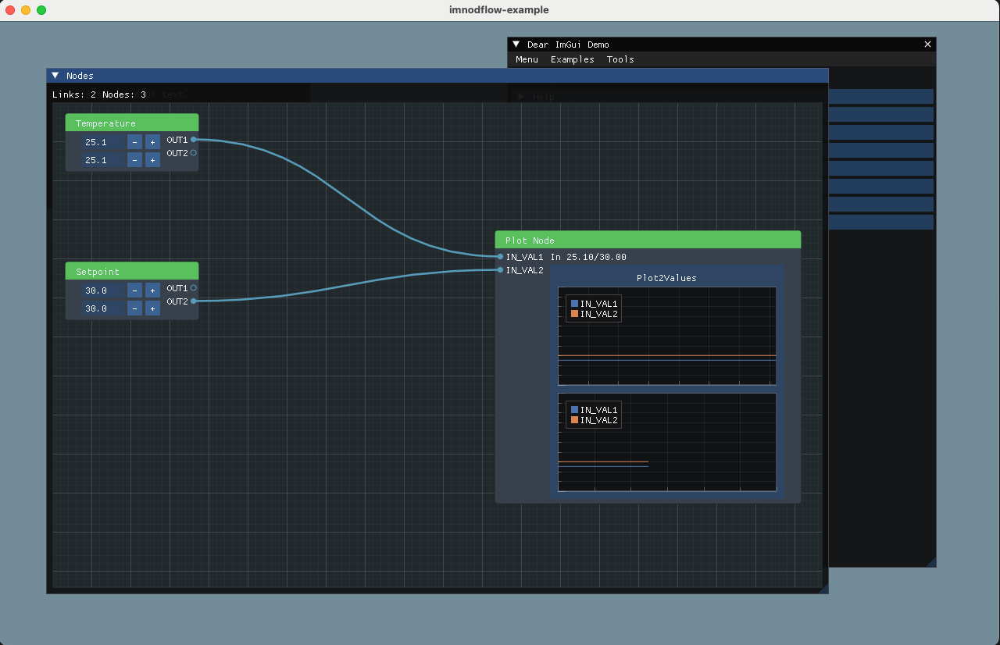

# imnodeflow-example



## Used libraries

| Name | Description | Link |
| --- | ----------- | ---|
| imgui | Dear ImGui is a bloat-free graphical user interface library for C++. | https://github.com/ocornut/imgui |
| Dear-ImGui-App-Framework | This repository is used to create simple applications based on Dear ImGui. It tries to keep dependencies to a minimum, and offer a fast and easy solution to build C++ apps with GUI. | https://github.com/ZenSepiol/Dear-ImGui-App-Framework |
| filebrowser | imgui-filebrowser is a header-only file browser implementation for dear-imgui. C++ 17 is required.  | https://github.com/AirGuanZ/imgui-filebrowser |
| glfw | GLFW is an Open Source, multi-platform library for OpenGL, OpenGL ES and Vulkan development on the desktop. It provides a simple API for creating windows, contexts and surfaces, receiving input and events. | https://www.glfw.org/ |
| glad | Multi-Language GL/GLES/EGL/GLX/WGL Loader-Generator based on the official specs. | https://glad.dav1d.de/ |
| implot | imgui plot library. | https://github.com/epezent/implot |
| ImNodeFlow | Node-based editor/blueprints for ImGui. | https://github.com/Fattorino/ImNodeFlow |


## Folder structure

```bash
|
 -- glfw
|
 -- imfilebrowser
|
 -- imgui
|
 -- ImNodeFlow
|
 -- imnodeflow-example -> this reopo
|
 -- implot
```

## imgui

Graphical GUI https://github.com/ocornut/imgui


### AppImGuiCRTP.hpp
The AppImGuiCRTP.hpp is based on:

https://github.com/ZenSepiol/Dear-ImGui-App-Framework/blob/main/src/lib/app_base/app_base.hpp

#### Based on CRTP

The curiously recurring template pattern (CRTP) is an idiom, originally in C++, in which a class X derives from a class template instantiation using X itself as a template argument.[1] More generally it is known as F-bound polymorphism, and it is a form of F-bounded quantification.

https://www.fluentcpp.com/2017/05/12/curiously-recurring-template-pattern/

